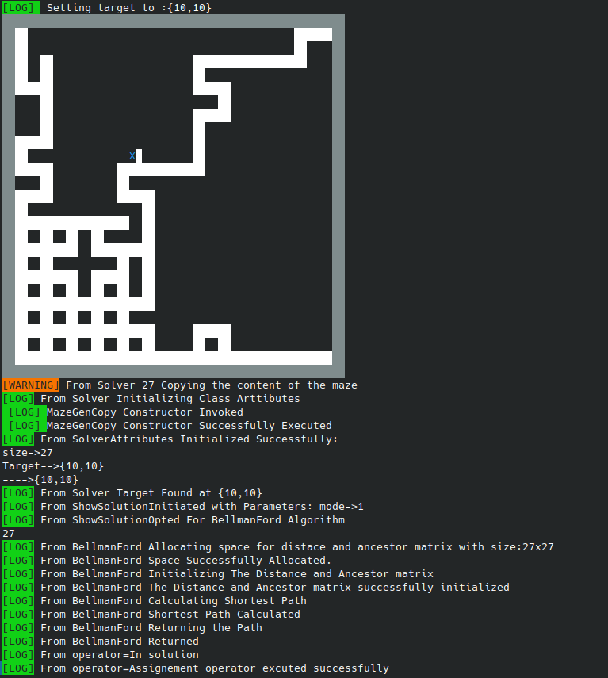
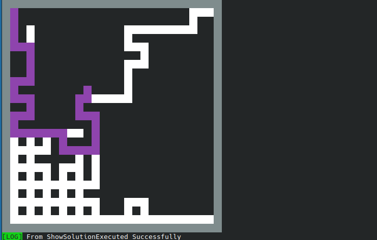

<span style="color:#fff; font-family: 'Bebas Neue'; font-size: 4em;">
<h1> Maze Generator</h1>
Maze generator is a command line software to generate a randomized maze for the given size (must be greater than 2. Once the maze is generated the Program outputs the shortest path to the target using `Bellman-Ford` [Link](https://en.wikipedia.org/wiki/Bellman–Ford_algorithm) Algorithm.

To run the program compile the main.cc using `clang` or `gcc`

For gcc : `g++ main.cc maze.cc solver.cc -o maze`

For clang : `clang++ main,cc maze.cc solver.cc -o maze`

<h3> Compile time flags</h3>

`-NVERBOSE` : Use it to stop verbosity of the execution.

`-NDEBUG` : To stop the Log statements use this flag.

`-PARENTMAT` :  Use this flag to print the Ancestor matrix built for the `Bellman-Ford`


Use the `maze` file using terminal.

<h3> Run time flags</h3>
<table>
<tr>
<td>Flag</td>
<td>Description</td>
<td>Example</td>
</tr>
<tr>
<td>`--size` or `-s`</td>
<td>set the size of maze</td>
<td>
Example: `./main --size 25`.
It will generate the 25x25 maze
</td>
</tr>
<tr>
<td>`--mode` or `-m`</td>
<td>`0` to print the path only. `1` to show the whole matrix</td>
<td>
Example: `./main --mode 0`.
</td>
</tr>
<tr>
<td>`--algo` or `-a`</td>
<td>`1` for Bellman Ford.  Others yet to implement</td>
<td>
Example: `./main -a 1`.
</td>
</tr>
</tr>
<tr>
<td>`--target` or `-t`</td>
<td>Set the target in the maze</td>
<td>
Example: ```./main -t 10 10```. Sets the target at `maze[10][10]`
</td>
</tr>
<table>

<h1> Screen Shots </h1>

![img1](mazeGenerator/img/Screenshot_20230916_142428.png]

![img2](mazeGenerator/img/Screenshot_20230916_1424252.png]




</span>
